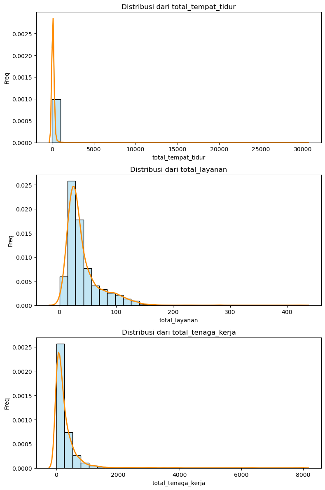
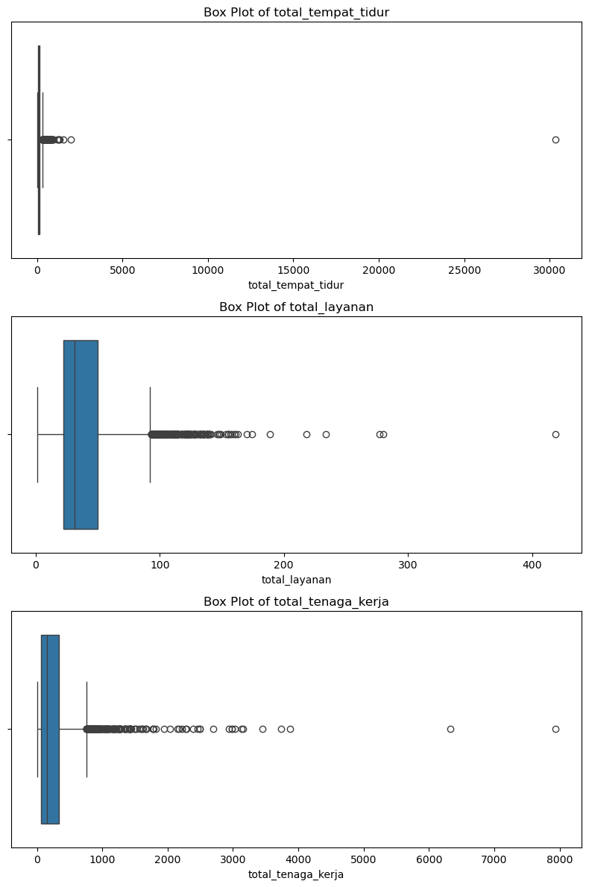
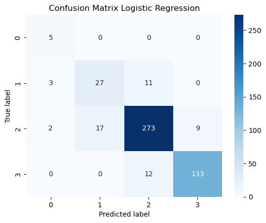

# Laporan Proyek Machine Learning - Wildan Bagus Wicaksono

## Domain Proyek

Indonesia memiliki lebih dari 17.000 pulau dan populasi yang melebihi 270 juta jiwa, menghadapi tantangan besar dalam menyediakan layanan kesehatan yang merata dan berkualitas. Salah satu upaya pemerintah dalam mengatasi tantangan ini adalah dengan mengklasifikasikan rumah sakit ke dalam beberapa kelas (A, B, C, dan D) berdasarkan kapasitas layanan, kelengkapan fasilitas, dan sumber daya manusia yang dimiliki. Klasifikasi ini penting untuk menentukan kesiapan institusi dalam menangani kasus-kasus medis yang kompleks dan sebagai dasar dalam perencanaan distribusi sumber daya kesehatan.

Namun, dalam praktiknya, tidak semua rumah sakit memiliki informasi kelas yang tercatat secara lengkap atau diperbarui secara berkala, terutama pada rumah sakit baru atau yang sedang dalam tahap pengembangan. Proses klasifikasi manual juga memerlukan waktu dan tenaga ahli, yang dapat menghambat proses perencanaan dan distribusi sumber daya secara efisien.

Untuk mengatasi permasalahan tersebut, pendekatan berbasis machine learning dapat digunakan untuk membangun model klasifikasi rumah sakit berdasarkan fitur-fitur yang tersedia seperti jumlah tempat tidur, layanan yang ditawarkan, dan jenis kepemilikan. Model ini dapat menjadi alat bantu bagi pemerintah atau instansi kesehatan untuk mempercepat klasifikasi awal, memprioritaskan verifikasi manual, serta mendukung proses pengambilan keputusan berbasis data.

Studi oleh Nurhaida et al. (2023) menunjukkan bahwa penerapan algoritma machine learning seperti Linear Discriminant Analysis (LDA) dapat mencapai akurasi hingga 71% dalam mengklasifikasikan kualitas rumah sakit berdasarkan indikator mutu selama pandemi COVID-19 . Hal ini menunjukkan potensi besar penggunaan machine learning dalam meningkatkan efisiensi dan akurasi klasifikasi rumah sakit di Indonesia.

Selain itu, laporan WHO (2021) menekankan pentingnya transformasi digital dalam sistem kesehatan, termasuk melalui pemanfaatan kecerdasan buatan, sebagai salah satu prioritas dalam mempercepat pencapaian cakupan kesehatan semesta (_Universal Health Coverage_). Dengan demikian, pemanfaatan model prediktif untuk klasifikasi rumah sakit di Indonesia merupakan langkah strategis untuk meningkatkan efisiensi dan kualitas pelayanan kesehatan.

**Referensi**

[1] Nurhaida, I., Dhamanti, I., Ayumi, V., Yakub, F., & Tjahjono, B. (2023). _Hospital quality classification based on quality indicator data during the COVID-19 pandemic_. International Journal of Electrical and Computer Engineering (IJECE), 13(4), 4365-4375. https://doi.org/10.11591/ijece.v13i4.pp4365-4375.

[2] Kementerian Kesehatan RI. (2022). _Data dan Informasi Profil Rumah Sakit di Indonesia_. Jakarta: Pusat Data dan Informasi Kemenkes RI.

[3] World Health Organization. (2021). _Universal Health Coverage in Indonesia: Progress and Challenges_. Geneva: WHO.

## Business Undestanding

### Problem Statements

- Bagaimana cara memprediksi kelas rumah sakit (A, B, C, D) berdasarkan fitur-fitur operasional dan administratif yang tersedia?

- Algoritma machine learning mana yang memiliki performa terbaik dalam melakukan klasifikasi kelas rumah sakit?

### Goals

- Mengembangkan model machine learning untuk mengklasifikasikan rumah sakit ke dalam kelas yang sesuai berdasarkan fitur-fitur seperti kapasitas, layanan, tenaga kerja, dan informasi administratif lainnya.

- Melakukan perbandingan performa antara algoritma Random Forest dan Logistic Regression dalam menyelesaikan tugas klasifikasi ini.

### Solution statements

- Menggunakan dua algoritma klasifikasi: Random Forest (tanpa kebutuhan scaling) dan Logistic Regression (dengan scaling dan transformasi log untuk menangani skewness).

- Melakukan preprocessing data yang mencakup:

  - Penanganan missing value dan duplikasi

  - Penggabungan label kategori serupa

  - Transformasi logaritmik untuk fitur skewed

  - One-hot encoding untuk fitur kategorikal

  - Penanganan outlier dengan IQR filtering

- Melakukan evaluasi menggunakan metrik accuracy, precision, recall, dan F1-score, serta menggunakan confusion matrix dan classification report.

- Menambahkan strategi peningkatan performa melalui:

  - Resampling (SMOTETomek) untuk mengatasi imbalance

  - Class weight tuning

  - Hyperparameter tuning menggunakan GridSearchCV

## Data Understanding

Dataset ini berisi informasi rumah sakit yang tersebar di seluruh provinsi di Indonesia. Dataset dapat diakses melalui link berikut:

[Hospital Data in Indonesia](https://www.kaggle.com/datasets/muhammadhabibna/hospital-data-in-indonesia)

Dataset dalam format `csv` yang terdiri dari 3155 baris dan 12 kolom. Dataset ini digunakan untuk memprediksi kelas rumah sakit (A, B, C, D).

### 1. Deskripsi Fitur

Adapun variabel yang tersedia dan penjelasannya ada pada tabel berikut.
| **Nama Variabel** | **Penjelasan** |
|----------------------|-------------------------------------------------------------|
| `id` | ID unik rumah sakit |
| `nama` | Nama rumah sakit |
| `propinsi` | Lokasi provinsi |
| `kab` | Lokasi kota/kabupaten |
| `alamat` | Alamat lengkap rumah sakit |
| `jenis` | Jenis rumah sakit (Umum, Khusus, dan lain-lain) |
| `kelas` | Kelas rumah sakit (A, B, C, D) |
| `status_blu` | Status pengelolaan keuangan (BLU / BLUD / Non-BLU) |
| `kepemilikan` | Kepemilikan rumah sakit (Pemerintah, Swasta, dan lain-lain) |
| `total_tempat_tidur` | Jumlah tempat tidur yang tersedia |
| `total_layanan` | Jumlah jenis layanan kesehatan yang tersedia |
| `total_tenaga_kerja` | Jumlah tenaga kerja rumah sakit |

### 2. Distribusi Kelas

Distribusi target sangat tidak seimbang yang didominasi oleh kelas C dan D.
| **Kelas** | **Banyak** | **Prosentase** |
|:-----------------------:|:----------:|:--------------:|
| A | 26 | 0,008 |
| B | 203 | 0,064 |
| C | 1502 | 0,476 |
| D | 726 | 0,230 |
| D PRATAMA | 64 | 0,020 |
| Rumah Sakit Khusus Jiwa | 1 | 0,000 |
| Rumah Sakit Umum | 3 | 0,000 |
| Belum Ditetapkan | 3 | 0,000 |

Diperlukan penangan ketisakseimbangan data saat pemodelan seperti menggunakan _class weighting_ atau oversampling. Selain itu, ada nilai yang tidak konsisten seperti `Rumah Sakit Khusus Jiwa` dan `Rumah Sakit Umum` yang harusnya terletak pada kolom `jenis`.

### 3. Distribusi dan Outlier Fitur Numerik

Untuk memahami karakteristik data numerik, dilakukan eksplorasi awal terhadap tiga fitur utama yaitu `total_tempat_tidur`, `total_layanan`, dan `total_tenaga_kerja` menggunakan boxplot dan density plot (KDE).




a. `total_tempat_tidur`

Boxplot menunjukkan adanya banyak outlier, bahkan terdapat nilai ekstrem di atas 30.000 tempat tidur, yang tidak wajar untuk ukuran rumah sakit di Indonesia. Distribusi fitur ini sangat right-skewed dan terkonsentrasi pada nilai di bawah 500.

b. `total_layanan`

Fitur ini menggambarkan jumlah jenis layanan medis yang disediakan oleh rumah sakit. Mayoritas rumah sakit memiliki kurang dari 100 layanan, tetapi terdapat beberapa rumah sakit yang memiliki lebih dari 400 jenis layanan. Distribusinya juga menunjukkan kemiringan ke kanan (right-skewed), dengan outlier yang terlihat jelas.

c. `total_tenaga_kerja`

Jumlah tenaga kerja per rumah sakit juga memiliki distribusi miring ke kanan dengan nilai outlier yang mencapai lebih dari 8.000 tenaga kerja. Hal ini menunjukkan ketimpangan antara rumah sakit besar dan kecil.

## Data Preparation

### 1. Menghapus data, kolom yang tidak relevan, dan mengganti beberapa kelompok nilai ke nilai yang lebih seragam dan informatif

- Menghapus kolom `id`, `nama`, dan `alamat` karena tidak informatif untuk prediksi. Ini dilakukan untuk menghindari noise dalam model.
- Kolom `kab` dihapus karena memiliki jumlah kategori yang sangat banyak dan sulit untuk digeneralisasi.
- Kolom `propinsi` tidak digunakan secara langsung (karena terlalu beragam). Sebagai gantinya, dibuat kolom baru bernama `bagian` yang merupakan gabungan provinsi ke dalam 4 wilayah besar: Jawa, Sumatera, Kalimantan, dan Indonesia Timur. Hal ini dilakukan untuk menyederhnakan variasi wilayah dengan tetap mempertahankan informasi yang diberikan.
- Menghapus data pada kolom yang tidak bersesuaian, seperti "BLU" atau "BLUD" ada pada kolom `jenis` yang seharusnya pada kolom `status_blu`. Nilai yang invalid akan dirubah ke `NaN` agar sekaligus dibuang pada proses kedua.
- Nilai tidak valid seperti `021-...1`, `'-'`, `''`, atau `' '` pada kolom `jenis`, `status_blu`, dan `kepemilikan` dikonversi menjadi `NaN` agar dapat terdeteksi sebagai missing values.

### 2. Mengatasi missing values dan duplikat

- Mengecek nilai kosong dengan `isnull().sum()`, lalu diisi dengan strategi:
  - Kolom numerik diisi dengan median.
  - Kolom kategorikal diisi menggunakan modus jika jumlah missing-nya masih wajar, atau dihapus jika sangat sedikit.
- Seluruh baris yang memiliki nilai `NaN` dihapus dengan `dropna()`.
- Data duplikat dihapus menggunakan `drop_duplicates()` untuk menghindari bias dalam pelatihan model.

### 3. Mengatasi outlier dan melakukan transformasi fitur

- Outlier pada fitur numerik yang diidentifikasi dengan boxplot diatasi menggunakan metode IQR. Nilai dianggap outlier jika berada di luar rentang $Q_1-1.5\times IQR$ dan $Q_3+1.5\times IQR$. Jika jumlah data outlier sedikit, data tersebut dihapus langsung. Berikut implementasinya.

  ```py
  Q1 = df[col_numeric].quantile(0.25)
  Q3 = df[col_numeric].quantile(0.75)
  IQR = Q3 - Q1

  # Buat kondisi hanya untuk kolom numerik
  condition = ~((df[col_numeric] < (Q1 - 1.5 * IQR)) | (df[col_numeric] > (Q3 + 1.5 * IQR))).any(axis=1)

  # Filter semua kolom berdasarkan baris yang lolos
  df = df[condition]
  ```

- Distribusi ketiga fitur tersebut sangat skewed ke kanan. Oleh karena itu, dilakukan transformasi logaritmik `(log1p)` khususnya untuk model seperti Logistic Regression yang sensitif terhadap distribusi data. Sebelum ditransformasikan akan diperiksa skewness kolom numerk tersebut.
  ```py
  # menghitung skewness
  df[col_numeric].skew()
  ```
- Apabila skewness > 1 atau < -1, maka kolom tersebut dilakukan log-transformation. Sebelum itu, kita buat dataframe baru yang merupakan salinan dari `df`, sebagai pemisah antara dataframe yang dilakukan transformasi dan tidak.
  ```py
  df_transform = df.copy()
  ```
  ```py
  # melakukan transformasi log pada kolom numerik
  for col in col_numeric[1:]:
      df_transform[col] = np.log1p(df_transform[col])
  ```

### 4. Encoding variabel kategorikal

- Seluruh variabel kategorikal seperti `bagian`, `jenis`, `status_blu`, dan `kepemilikan` diubah menjadi format numerik menggunakan One-Hot Encoding. Pemilihan encoding ini dikarenakan tidak memiliki hubungan hierarki antar nilai. Digunakan parameter `drop_first=True` untuk menghindari dummy variable trap.
  ```py
  col_categorical = ['bagian', 'jenis', 'status_blu', 'kepemilikan']
  ```
  ```py
  # melakukan encode pada fitur kolom kategorikal dengan One-Hot Encoding
  df_encoded = pd.get_dummies(df, columns=col_categorical, drop_first=True)
  df_transform_encoded = pd.get_dummies(df_transform, columns=col_categorical, drop_first=True)
  ```
- Variabel target kelas juga diubah menjadi angka dengan Label Encoding untuk pemodelan nanti.
- Label target (`kelas`) juga diencode menjadi nilai numerik menggunakan `LabelEncoder` agar sesuai dengan model klasifikasi.
  ```py
  # melakukan encode pada fitur target dengan LabelEncoder
  y = LabelEncoder().fit_transform(df['kelas'])
  ```

### 5. Feature scaling

```py
scaler = StandardScaler()
df_transform_encoded[col_numeric] = scaler.fit_transform(df_transform_encoded[col_numeric])
df_transform_encoded
```

- Scaling hanya dilakukan untuk model yang memerlukannya, yaitu Logistic Regression. Scaling dilakukan dengan `StandardScaler()`.

- Dilakukan standarisasi untuk kolom numerik, yaitu `total_tempat_tidur`, `total_layanan`, dan `total_tenaga_kerja` karena akan digunakan pada model Logistic Regression.

### 6. Split data

- Data dibagi menjadi training dan testing set dengan perbandingan 80:20 menggunakan `train_test_split`.
- Parameter `stratify=y` digunakan untuk menjaga distribusi kelas tetap proporsional pada data pelatihan dan pengujian.
- Pembagian dilakukan dua kali: satu untuk dataset transformasi log, satu untuk data tanpa transformasi (untuk perbandingan antar model).

### 7. Menangani class imbalance

- Untuk mengatasi ketidakseimbangan kelas pada label target `kelas`, digunakan tekhnik SMOTETomek (Synthetic Minority Oversampling + Tomek Links).
- SMOTETomek merupakan pendekatan kombinasi yang meliputi:
  - SMOTE: menambahkan data sintetis pada kelas minoritas.
  - Tomek Links: Menghapus pasangan data yang berada terlalu dekat di perbatasan antar kelas, sehingga memperjelas batas klasifikasi.
- Pendekatan ini tidak hanya meningkatkan proporsi data minoritas, tetapi juga membantu membersihkan noise dan ambiguitas antar kelas.
- Resampling dilakukan setelah pembagian data training dan testing, agar tidak terjadi data leakage.
- Seluruh model yang melibatkan penanganan imbalance dalam eksperimen ini menggunakan pendekatan SMOTETomek secara konsisten.
- Resampling menggunakan SMOTETomek memerlukan `from imblearn.combine import SMOTETomek`. Selanjutnya, resampling dapat diimplementasikan sebagai berikut.

  ```py
  smotetomek = SMOTETomek(random_state=42)

  X_train_resampled_smotetomek, y_train_resampled_smotetomek = smotetomek.fit_resample(X_train, y_train)

  print("Distribusi kelas sebelum oversampling:", Counter(y_train))
  print("Distribusi kelas setelah oversampling:", Counter(y_train_resampled_smotetomek))
  ```

## Modeling

Algoritma yang digunakan adalah Logistic Regression (multiclass) dan Random Forest. Untuk Logistic Regression akan menggunakan data yang telah ditransformasi pada tahap **Data Preparation**, sedangkan untuk Random Forest diterapkan pada data tanpa transformasi. Kedua model dilatih untuk memprediksi kelas rumah sakit berdasarkan fitur-fitur numerik (jumlah tempat tidur, layanan, dan tenaga kerja) serta fitur kategorikal (jenis, status BLU, kepemilikan, dan wilayah).

### 1. Random Forest

Random Forest merupakan algoritma ensemble learning berbasis pohon keputusan (decision tree) yang bekerja dengan membangun banyak pohon (forest) dan menggabungkan hasil prediksinya (voting mayoritas untuk klasifikasi). Setiap pohon dibangun dari subset data training dan subset fitur (dengan teknik bootstrap dan random feature selection), sehingga menghasilkan model yang lebih stabil dan tidak mudah overfitting.

Pada tiap pohon:

- Data training dibagi secara acak (bootstrapped).
- Saat pembentukan node, hanya subset fitur yang dipilih secara acak.
- Hasil akhir prediksi diperoleh melalui voting mayoritas dari seluruh pohon.

Random Forest efektif untuk menangani data dengan:

- Kombinasi fitur numerik dan kategorikal.
- Adanya outlier dan distribusi data yang skewed.
- Kompleksitas hubungan non-linear antar fitur.

Parameter umum yang digunakan dalam Random Forest adalah sebagai berikut.
| Parameter | Fungsi |
| ------------------- | -------------------------------------------------------------------------------------------------------------------------- |
| `n_estimators` | Jumlah pohon yang akan dibangun dalam forest. Nilai default: `100`. |
| `max_depth` | Kedalaman maksimum tiap pohon. Jika `None` (nilai default), pohon tumbuh hingga daun sempurna. |
| `min_samples_split` | Jumlah minimal sampel untuk memecah (split) internal node. Nilai default: `2`. |
| `min_samples_leaf` | Jumlah minimal sampel yang harus ada pada setiap daun. Nilai default: `1`. | |
| `class_weight` | Untuk menangani ketidakseimbangan kelas. `'balanced'` akan menyesuaikan bobot kelas secara otomatis berdasarkan frekuensi. Nilai default: `None`. |
| `random_state` | Menetapkan seed agar hasil dapat direproduksi. |

Model ini dipilih karena:

- Mampu menangani fitur numerik dan kategorikal tanpa perlu normalisasi.
- Tahan terhadap outlier dan skewness.
- Dapat memberikan interpretasi terhadap fitur penting (feature importance).

Dibalik kelebihannya, model ini memiliki kekurangan:

- Cenderung menghasilkan model yang kompleks dan sulit diinterpretasi.
- Waktupelatihan relatif lebih lama, terutama saat tuning dengan GridSearchCV.
- Performa dapat menurun jika data sangat tidak seimbang sehingga diperlukan teknik resampling atau penyesuaian bobot kelas.

Model dilatih menggunakan data tanpa transformasi log.

#### Skema 1: Baseline

Model ini menjadi pembanding awal performa model sebelum dilakukan oversampling atau tuning.

```py
rf_scheme_1 = RandomForestClassifier(
    n_estimators=100,
    max_depth=None,
    min_samples_split=2,
    min_samples_leaf=1,
    class_weight='balanced',
    random_state=42
)

rf_scheme_1.fit(X_train, y_train)
y_pred_rf = rf_scheme_1.predict(X_test)
```

Parameter awal yang digunakan:

- `n_estimators=100`,
- `max_depth=None`,
- `min_samples_split=2`,
- `min_samples_leaf=1`,
- `class_weight='balanced'`,
- `random_state=42`.

Adapun hasil yang diperoleh:

- Akurasi mencapai 88.6%
- Kelas `1` memiliki F1-Score hanya 0.50 yang menunjukkan model belum cukup peka terhadap kelas minoritas.

#### Skema 2: Resampling dengan SMOTETomek

Pada skema ini mengatasi ketidakseimbangan distribusi kelas dengan kombinasi oversampling (SMOTE) dan undersampling (Tomek).

```py

rf_scheme_2 = RandomForestClassifier(
    n_estimators=100,
    max_depth=None,
    class_weight='balanced',
    random_state=42
)

rf_scheme_2.fit(X_train_resampled_smotetomek, y_train_resampled_smotetomek)
y_pred_rf_2 = rf_scheme_2.predict(X_test)
```

Adapun hasil yang diperoleh:

- Akurasi mencapai 88.6%
- F1-score kelas `1` meningkat menjadi 0.61 sehingga model menjadi lebih seimbang.

#### Skema 3: Resampling dan hyperparameter tuning

Model pada skema 2 akan dioptimalkan melalui tuning parameter. Untuk melakukan ini menggunakan `GridSearchCV` dan `RandomizedSearchCV` sebagai metode pencarian kombinasi parameter terbaik.

- `GridSearchCV`: Mencoba seluruh kombinasi parameter dalam grid yang ditentukan (menyeluruh namun mahal secara komputasi)..
- `RandomizedSearchCV`: Mencoba subset parameter secara acak (lebih efisien, cocok untuk ruang parameter besar).

Sebelum melakukan pengujian pada mode, kita perlu menetapkan parameter yang ingin diujikan.

```py
# parameter yang diuji dengan Grid Search
param_grid = {
    'n_estimators': [100, 200, 300],
    'max_depth': [None, 10, 20, 30],
    'min_samples_split': [2, 5, 10],
    'min_samples_leaf': [1, 2, 4],
    'class_weight': ['balanced', {0:1, 1:3, 2:1, 3:1.5}]
}

# parameter yang diuji dengan Random Search
param_random = {
    'n_estimators': randint(100, 300),
    'max_depth': [None] + list(range(5, 31, 5)),
    'min_samples_split': randint(2, 11),
    'min_samples_leaf': randint(1, 5),
    'class_weight': ['balanced', None]
}
```

Proses tuning dilakukand engan cross-validation (`cv=5`) pada dara hasil SMOTETomek untuk mencari kombinasi parameter yang menghasilkan skor F1-macro tertinggi.

- Implementasi metode pencarian dengan `GridSearchCV`.
  ```py
  grid_search = GridSearchCV(
      estimator=RandomForestClassifier(random_state=42),
      param_grid=param_grid,
      scoring='f1_macro',
      cv=5,
      n_jobs=-1,
      verbose=2
  )
  grid_search.fit(X_train_resampled_smotetomek, y_train_resampled_smotetomek)
  ```
  Diperoleh parameter terbaik menggunakan `GridSearchCV`.
  ```py
  class_weight='balanced', max_depth=20, min_samples_split=5, n_estimators=300, random_state=42
  ```
- Implementasi metode pencarian dengan `RandomizedSearchCV`.
  ```py
  random_search = RandomizedSearchCV(
      estimator=RandomForestClassifier(random_state=42),
      param_distributions=param_random,
      scoring='f1_macro',
      n_iter=30,
      cv=5,
      verbose=2,
      n_jobs=-1,
      random_state=42
  )
  random_search.fit(X_train_resampled_smotetomek, y_train_resampled_smotetomek)
  ```
  Diperoleh parameter terbaik menggunakan `RandomizedSearchCV`.
  ```py
  class_weight='balanced', max_depth=25, min_samples_split=3, n_estimators=187, random_state=42
  ```

Model dilatih menggunakan parameter baru yang telah ditentukan.

```py
# menyimpan model dengan parameter terbaik
model_grid = grid_search.best_estimator_
model_random = random_search.best_estimator_

# Prediksi menggunakan data test
y_pred_grid = model_grid.predict(X_test)
y_pred_random = model_random.predict(X_test)
```

Hasil terbaik yang diperoleh:

- Menggunakan `RandomizedSearchCV`.
- Akurasi mencapai 89%
- F1-score kelas 1 meningkat menjadi 0.64
- Macro average F1-score mendapatkan 0.79

Dari model ini diperoleh skema 3 memberikan hasil terbaik karena:

- Performa keseluruhan paling tinggi secara metrik macro maupun per kelas.
- Memperbaiki kinerja pada kelas minoritas dibanding baseline dan resampling tanpa tuning.
- Menghindari overfitting berkat kombinasi tuning dan balancing.

### 2. Logistic Regression

Logistic Regression digunakan sebagai pembanding terhadap Random Forest karena bersifat lebih sederhana dan cocok untuk baseline model klasifikasi multikelas. Model ini dilatih menggunakan data transformasi (log dan standard scaler) karena Logistic Regression sensitif terhadap skala dan distribusi data numerik.

Logistic Regression bekerja dengan memodelkan hubungan antara fitur input dan probabilitas suatu kelas menggunakan fungsi logistik (sigmoid).
Untuk kasus multikelas, digunakan pendekatan multinomial (softmax), di mana:

- Probabilitas masing-masing kelas dihitung melalui fungsi softmax.
- Kelas dengan probabilitas tertinggi dipilih sebagai output.

Model ini mengasumsikan hubungan linear antara fitur dan log-odds kelas target, sehingga lebih cocok untuk data yang memenuhi asumsi tersebut.

Parameter umum yang digunakan dalam Logistic Regression adalah sebagai berikut.

| Parameter      | Fungsi                                                                                                                            |
| -------------- | --------------------------------------------------------------------------------------------------------------------------------- |
| `penalty`      | Jenis regularisasi yang digunakan. Default: `'l2'`. Membantu mencegah overfitting dengan mengurangi kompleksitas model.           |
| `C`            | Invers dari kekuatan regularisasi. Nilai default: `1.0`. Nilai lebih kecil berarti regularisasi lebih kuat.                       |
| `solver`       | Algoritma optimasi untuk menemukan parameter terbaik. Default: `'lbfgs'`. Cocok untuk dataset sedang dan mendukung `multinomial`. |
| `multi_class`  | Skema klasifikasi multikelas. Default: `'auto'`, yang menyesuaikan otomatis antara `'ovr'` dan `'multinomial'`.                   |
| `max_iter`     | Jumlah maksimum iterasi untuk mencapai konvergensi. Default: `100`. Perlu dinaikkan jika data kompleks atau telah ditransformasi. |
| `class_weight` | Untuk menangani ketidakseimbangan kelas. `'balanced'` akan menyesuaikan bobot berdasarkan frekuensi kelas. Default: `None`.       |
| `max_iter`     | Jumlah iterasi maksimum yang dilakukan. Nilai default: `100`.                                                                     |
| `random_state` | Menetapkan seed agar hasil dapat direproduksi. Default: `None`. Direkomendasikan untuk hasil konsisten.                           |

Adapun kelebihan model ini:

- Cepat dan efisien untuk dataset berukuran sedang.
- Hasil lebih mudah diinterpretasikan.
- Cocok untuk baseline model.
- Bisa menangani data tidak seimbang jika menggunakan `class_weight='balanced'`.

Adapun kekurangan model ini:

- Performa menurun jika terdapat hubungan non-linear antar fitur dan target.
- Sensitif terhadap outlier.
- Membutuhkan transformasi fitur numerik dan one-hot encoding untuk hasil optimal.

#### Skema 1: Baseline

Model ini menjadi pembanding awal performa model sebelum dilakukan oversampling atau tuning.

```py
lr_scheme_1 = LogisticRegression(
    multi_class='multinomial',
    solver='lbfgs',
    max_iter=1000,
    class_weight='balanced',
    random_state=42
)

lr_scheme_1.fit(X_train_transform, y_train_transform)
y_pred_lr_scheme_1 = lr_scheme_1.predict(X_test_transfrom)
```

Di sini menggunakan parameter:

- `multi_class='multinomial'` dan `solver='lbfgs` karena ada lebih dari 2 variabel target (multiclass),
- `class_weight='balanced'` untuk menyesuaikan kontribusi setiap kelas,
- `max_iter=1000` untuk menentukan jumlah iterasi maksimum,
- `random_state=42` untuk seed acak agar hasil dapat direproduksi.

Adapun hasil yang diperoleh:

- Akurasi mencapai 80.6%
- F1-score kelas `1` adalah 0.53.
- Macro Average sebesar 0.65.

#### Skema 2: Resampling dan Polynomial Feature

Skema ini menggunakan tekhnik SMOTE untuk mengatasi ketidakseimbangan kelas target. Selain itu, fitur numerik ditransformasikan dengan `polynomialFeature` derajat 2 (dengan parameter `interaction_only=True`) untuk menghasilkan fitur-fitur interaksi antar variabel numerik. Teknik ini berguna dalam memperluas ruang fitur agar model linear seperti Logistic Regression mampu menangkap pola non-linear antar fitur prediktor.

```py
poly = PolynomialFeatures(degree=2, interaction_only=True, include_bias=False)
X_poly = poly.fit_transform(X_transform)
X_test_poly = poly.transform(X_test_transfrom)

X_res_poly, y_res_poly = smotetomek.fit_resample(X_poly, y)

lr_scheme_2 = LogisticRegression(
    multi_class='multinomial',
    solver='lbfgs',
    max_iter=1000,
    class_weight='balanced',
    C=0.1,
    random_state=42
)
lr_scheme_2.fit(X_res_poly, y_res_poly)

y_pred_lr_scheme_2 = lr_scheme_2.predict(X_test_poly)

```

Di sini menggunakan parameter `C=0.1` untuk regularisasi kuat agar tidak overfitting terhadap fitur baru. Diperoleh hasil:

- Akurasi model menjadi 88.0% yang cukup signifikan naik dibandingkan baseline.
- F1-Score kelas `1` mengalami peningkatkan menjadi 0.73.

### 3. Pemilihan Model

Random Forest adalah model terbaik untuk tugas ini berdasarkan metrik evaluasi (akurasinya lebih tinggi dan macro F1-score sedikit lebih baik).
Model ini lebih konsisten dalam menangani variasi kelas dan memberikan prediksi yang lebih seimbang meskipun kelas tidak seimbang.

Namun, Logistic Regression Skema 2 bisa menjadi alternatif yang lebih ringan dan lebih mudah dijelaskan, terutama jika interpretabilitas penting atau komputasi terbatas.

## Evaluation

Evaluasi model dalam proyek ini dilakukan dengan menggunakan metrik-metrik evaluasi klasifikasi yaitu confusion matrix, accuracy, precision, recall, dan F1-score. Metrik ini dipilih karena sesuai untuk permasalahan klasifikasi multi-kelas (kelas A, B, C, dan D pada rumah sakit), dan memberikan pemahaman menyeluruh terhadap kinerja model di masing-masing kelas.

### 1. Confusion Matrix

Confusion matrix merupakan tabel yang menunjukkan jumlah prediksi benar dan salah untuk setiap kelas. Dengan melihat confusion matrix, kita dapat mengetahui berapa banyak data dari setiap kelas yang berhasil diprediksi dengan benar (true positive) dan berapa banyak yang salah diklasifikasikan ke kelas lain (false positive dan false negative). Perhatikan Confusion Matrix dari `RandomForestClassifier` Skema 3.



Interpretasi:

- Model berhasil mengklasifikasikan seluruh data kelas `0` dengan sempurna (5 data).
- Untuk kelas `1`, terdapat 27 data diklasifikasikan dengan benar, namun 3 dan 11 data salah diklasifikasikan ke kelas `0` dan `2`.
- Kelas `2` memiliki performa cukup tinggi, dengan 273 prediksi benar dari total 301.
- Kelas `3` juga menunjukkan performa stabil, dengan sebagian kecil data (12) salah diklasifikasikan sebagai kelas `2`.

Confusion matrix ini menjadi dasar untuk menghitung metrik evaluasi seperti precision, recall, f1-score, dan accuracy, yang akan dijelaskan lebih lanjut.

### 2. Metrik Evaluasi

- Accuracy mengukur proporsi prediksi benar dari keseluruhan data, dirumuskan dengan
  $$ \text{Accuracy} = \frac{\text{\text{jumlah prediksi benar}}}{\text{total data}} .$$
- Precision mengukur proporsi prediksi benar dari semua yang diprediksi sebagai kelas tertentu, dirumuskan dengan
  $$ \text{Precision} = \frac{\text{Ture Positive}}{\text{True Positive} + \text{False Negative}}.$$
- Recall mengukur proporsi data dari suatu kelas yang berhasil dikenali oleh model, dirumuskan dengan
  $$ \text{Recall} = \frac{\text{True Positive}}{\text{True Positive} + \text{False Negative}} .$$
- F1-score adalah rataan harmonik dari precision dan recall, memberikan keseimbangan antara keduanya, yaitu
  $$ \text{F1-Score} = \frac{2}{\frac{1}{\text{Precision}} + \frac{1}{\text{Recall}}} = 2\times \frac{\text{Precision}\times\text{Recall} }{\text{Precision}+\text{Recall}}.$$

Berdasarkan Confusion Matrix dari `RandomForest` Skema 3 berikut:

- Kelas 0
  - True Positive (TP) = 5
  - False Positive (FP) = 3 + 2 = 5
  - False Negative (FN) = 0
  - Precision (P) = $ \frac{TP}{TP+FP} = \frac{5}{5+5}=0.50 $
  - Recall (R) = $ \frac{TP}{TP+FN} = \frac{5}{5+0} = 1.00 $.
  - F1-Score = $2\times \frac{P\times R}{P+R} = 0.67$.
- Kelas 1
  - TP = 27
  - FP = 17
  - FN = 3 + 11 = 14
  - Precision = $\frac{27}{27+17}=0.61$.
  - Recall = $\frac{27}{27+14} = 0.66$.
  - F1-Score = $2\times \frac{P+R}{P+R} = 0.64.$
- Kelas 2
  - TP = 273
  - FP = 11 + 12 = 23
  - FN = 2 + 17 + 9 = 28
  - Precision = $\frac{273}{273+23} =0.92$
  - Recall = $\frac{133}{133+12}=0.91$.
  - F1-Score = $2\times \frac{P\times R}{P+R}=0.91$.
- Kelas 3
  - TP = 133
  - FP = 9
  - FN = 12
  - Precision = $\frac{133}{133+9} = 0.94$.
  - Recall = $\frac{133}{133+12} = 0.92$.
  - F1-Score = $2\times \frac{P\times R}{P+R} = 0.93$.

Diperoleh accuracy model tersebut adalah
$$ \text{Accuracy} = \frac{\sum TP \;\text{semua kelas}}{\text{Total data}}=\frac{5 + 27 + 273+133}{492}=0.89.$$

Selain metrik evaluasi di atas, terdapat pula:

- Macro Average, yaitu rata-rata dari precision, recall, dan F1-score antar kelas tanpa mempertimbangkan jumlah data pada tiap kelas. Sehingga dapat dirumuskan dengan: $$\begin{align*} \text{Macro Precision} &=\frac{1}{n}\sum_{i=1}^n \text{Precision}_i\\ \text{Macro Recall} &= \frac{1}{n}\sum_{i=1}^n \text{Recall}_i \\ \text{Macro F1} &= \frac{1}{n} \sum_{i=1}^n F1_i\end{align*}$$ di mana $n$ menyatakan banyak kelas. Berdasarkan perhitungan sebelumnya, $$\begin{align*}
\text{Macro Precision} &= \frac{0.50+ 0.61 + 0.92 + 0.94}{4} &&= 0.74\\
\text{Macro Recall}    &= \frac{1.00+0.66+0.91+0.92}{4} &&= 0.87\\
\text{Macro F1}        &= \frac{0.67+0.64+0.91+0.93}{4} &&= 0.79 \end{align*}$$ Ini menunjukkan bahwa model bekerja cukup merata di semua kelas, meskipun masih lebih lemah di kelas minoritas (misalnya kelas 1).
- Support, yaitu jumlah sampel aktual dari setiap kelas dalam data uji. Nilai ini menunjukkan seberapa banyak data dari tiap kelas yang digunakan untuk menghitung metrik evaluasi. Sebagai contoh, jika support untuk kelas 2 adalah 301, artinya terdapat 301 sampel dari kelas 2 di dalam data uji. Nilai ini tidak mempengaruhi perhitungan metrik untuk masing-masing kelas, tetapi sangat penting dalam perhitungan weighted average, karena bobot dari masing-masing kelas ditentukan oleh support-nya.
- Weighted Average, yaitu rata-rata metrik yang mempertimbangkan proporsi jumlah data tiap kelas. Nilai ini lebih representatif terhadap performa umum model, karena menyesuaikan dengan jumlah data per kelas. Sehingga dapat dirumuskan dengan: $$\begin{align*} \text{Weighted Precision} &= \sum_{i=1}^n \left (\frac{\text{Support}_i}{\text{Total}} \times \text{Precision}_i \right )\\
\text{Weighted Recall} &= \sum_{i=1}^n \left (\frac{\text{Support}_i}{\text{Total}} \times \text{Recall}_i \right )\\
\text{Weighted F1} &= \sum_{i=1}^n \left (\frac{\text{Support}_i}{\text{Total}} \times \text{F1}_i \right )\\\end{align*}$$
  Berdasarkan perhitungan sebelumnya,
  $$
  \begin{align*} \text{Weighted Precision} &= \frac{5\times 0.50}{492} + \frac{41\times 0.61}{492}+\frac{301 \times 0.92}{492} + \frac{145\times 0.94}{492} &&= 0.90\\
  \text{Weighted Recall} &= \frac{5\times 1.00}{492} + \frac{41\times 0.66}{492}+\frac{301 \times 0.91}{492} + \frac{145\times 0.92}{492} &&= 0.89\\
  \text{Weighted F1} &= \frac{5\times 0.67}{492} + \frac{41\times 0.64}{492}+\frac{301 \times 0.91}{492} + \frac{145\times 0.93}{492} &&= 0.89\end{align*}
  $$
  Nilai ini menunjukkan bahwa model sangat baik secara keseluruhan, khususnya pada kelas mayoritas (kelas 2 dan 3).

### 3. Hasil Evaluasi Model

Berikut hasil akurasi yang diperoleh setiap model.

| Model                   | Skema                             | Accuracy  | F1-score Kelas 1 | Macro Avg F1-score | Keterangan                                       |
| ----------------------- | --------------------------------- | --------- | ---------------- | ------------------ | ------------------------------------------------ |
| **Random Forest**       | Skema 1 (Baseline)                | 88.6%     | 0.50             | 0.80               | Model belum cukup peka terhadap kelas minoritas. |
|                         | Skema 2 (SMOTETomek)              | 88.6%     | 0.61             | 0.78               | Peningkatan performa kelas 1, lebih seimbang.    |
|                         | Skema 3 (SMOTETomek + Tuning)     | **89.0%** | **0.64**         | **0.79**           | Performa terbaik secara keseluruhan.             |
| **Logistic Regression** | Skema 1 (Baseline)                | 80.6%     | 0.53             | 0.65               | Cukup baik untuk baseline, namun tertinggal.     |
|                         | Skema 2 (Polynomial + SMOTETomek) | 88.0%     | **0.73**         | **0.79**           | Performa sangat meningkat pada kelas minoritas.  |

Untuk Random Forest, model terbaik adalah Skema 3 karena memberikan keseimbangan terbaik antara akurasi dan F1-score untuk kelas minoritas. Untuk Logistic Regression, Skema 2 menunjukkan peningkatan signifikan berkat fitur interaksi dan balancing. Namun secara umum, Random Forest Skema 3 bisa dikatakan lebih seimbang dan unggul sebagai model utama, karena tetap menjaga akurasi tinggi dan performa makro yang baik, tanpa mengorbankan performa pada kelas minoritas secara drastis.

### 4. Hubungan dengan Business Understanding

Model ini dikembangkan untuk membantu mengklasifikasikan rumah sakit berdasarkan karakteristik operasionalnya agar dapat digunakan oleh stakeholder (misalnya pemerintah atau instansi pengawas) untuk:

- Mengevaluasi kualitas dan kapabilitas rumah sakit.
- Mengidentifikasi rumah sakit dengan kebutuhan khusus, misalnya dari segi layanan atau tenaga kerja.
- Mendukung pengambilan keputusan berbasis data, seperti dalam penyusunan kebijakan alokasi sumber daya, akreditasi, atau evaluasi pelayanan.

Dampak terhadap Problem & Goals:

- Model mampu mengklasifikasikan rumah sakit berdasarkan data fitur numerik dan kategorikal.
- Dengan macro average F1 di atas 0.75 pada model terbaik, performa sudah cukup baik untuk digunakan sebagai rekomendasi awal klasifikasi.
- Klasifikasi ini dapat berdampak langsung terhadap pemantauan kualitas layanan, penyaluran bantuan, dan prioritas pengembangan rumah sakit di berbagai wilayah.
